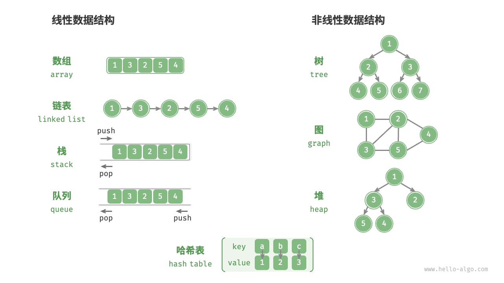

## 1. 数据结构
### 数据结构的种类
线性数据结构：数组、链表、栈、队列、哈希表
非线性数据结构：树、堆、图、哈希表



> 数据结构的存储方式只有两种：数组(顺序存储)和链表(链式存储)，其他均可以由这两种实现。
### 数组、链表的优点：
数组array：紧凑连续存储，可以随机访问，节约空间。因为是连续存储，内存空间必须一次性分配够，如扩容，需要重新分配一块更大的空间，再把数据全部复制过去，时间复杂度O(N); 在数组中间插入或删除元素，每次必须搬移后面的元素以保持连续，时间复杂度O(N)。
链表list：因为元素不连续，而是靠指针指向下一个元素的位置，所以不存在数组的扩容问题；如果知道某一元素的前驱和后驱，操作指针即可删除该元素或插入元素，时间复杂度O(1)。但正是因为存储空间不连续，无法根据索引算出对应元素的地址，所以不能随机访问；而且由于每个元素必须存储指向前后元素的指针，会消耗相对更多的存储空间。


## 2. 数据结构的基本操作
- 数组的遍历框架(典型的线性迭代结构)

```cpp
void traverse(vector<int>& arr){
    for (int i = 0; i < arr.size(); ++i){
        // 迭代访问 arr[i]
    }
}
```
- 链表的遍历框架, 兼具迭代和递归结构
```cpp


```